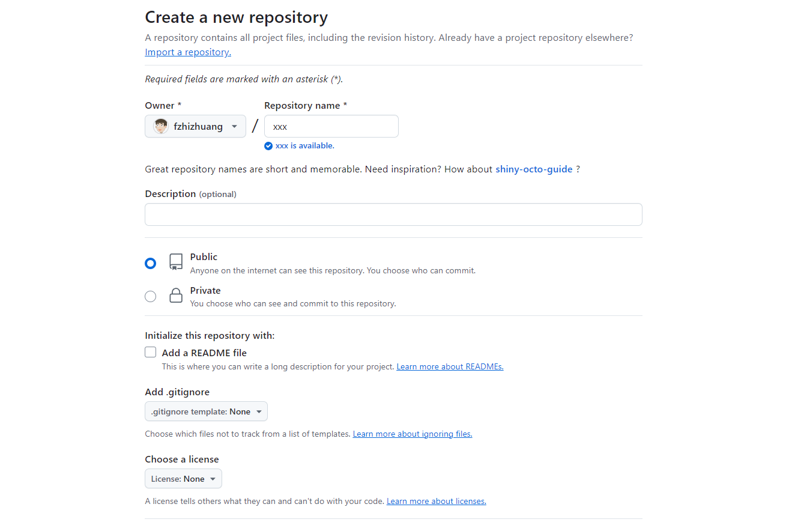
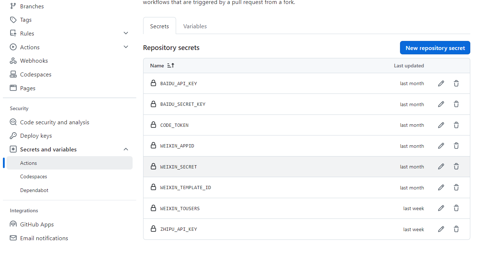
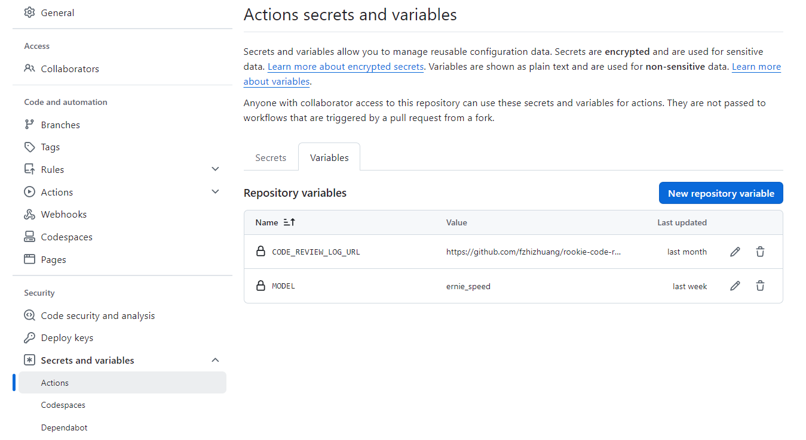

<h1 style="text-align: center">代码自动评审组件</h1>

## 使用教程
1. 创建GitHub仓库

2. 在仓库中配置以下内容
```markdown
GITHUB_REVIEW_LOG_URL: 代码评审组件的日志路径
GITHUB_TOKEN: GitHub （setting-> Developer Settings -> Personal access tokens -> tokens ）
WEIXIN_APPID: 微信appid
WEIXIN_SECRET: 微信secret
WEIXIN_TOUSERS: 要通知的用户 [","-分割符]
WEIXIN_TEMPLATE_ID: 通知模板
MODEL: Ai对话模型
BAIDU_API_KEY: 百度大模型 apikey
BAIDU_SECRET_KEY: 百度大模型 secretKey
ZHIPU_API_KEY: 智谱大模型 apikey
```
secrets配置


variables配置


3.配置Github Action
```yaml
name: Run Code Review

on: 
  push:
    branches: 
      - main  # 推送到main分支上执行
jobs:
  build-and-run:
    runs-on: ubuntu-latest
    steps:
      - name: Checkout Repository
        uses: actions/checkout@v4 # 切换分支
        with: 
          fetch-depth: 2 # 检出最后的两次提交，后续进行比较
          
      - name: Set Up JDK21
        uses: actions/setup-java@v4 # 安装jdk21
        with: 
          distribution: 'temurin'
          java-version: '21'
          cache: maven

      - name: create libs directory # 创建libs目录
        run: mkdir -p ./libs

      - name: Download Code Review SDK JAR
        run: wget --tries=5 --wait=10 -O ./libs/icode-review-1.1.jar https://github.com/fzhizhuang/code-review/releases/download/v1.1/icode-review-1.1.jar

      - name: Get repository name
        id: repo-name
        run: echo "REPO_NAME=${GITHUB_REPOSITORY##*/}" >> $GITHUB_ENV

      - name: Get branch name
        id: branch-name
        run: echo "BRANCH_NAME=${GITHUB_REF#refs/heads/}" >> $GITHUB_ENV

      - name: Get commit author
        id: commit-author
        run: echo "COMMIT_AUTHOR=$(git log -1 --pretty=format:'%an <%ae>')" >> $GITHUB_ENV

      - name: Get commit message
        id: commit-message
        run: echo "COMMIT_MESSAGE=$(git log -1 --pretty=format:'%s')" >> $GITHUB_ENV

      - name: Print repository, branch name, commit author, and commit message
        run: |
          echo "Repository name is ${{ env.REPO_NAME }}"
          echo "Branch name is ${{ env.BRANCH_NAME }}"
          echo "Commit author is ${{ env.COMMIT_AUTHOR }}"
          echo "Commit message is ${{ env.COMMIT_MESSAGE }}"      

          

      - name: Run Code View
        run: java -jar ./libs/icode-review-1.1.jar # 运行jar包
        env:
          # Github配置
          GITHUB_REVIEW_LOG_URL: ${{ vars.CODE_REVIEW_LOG_URL }}
          GITHUB_TOKEN: ${{ secrets.CODE_TOKEN }}
          COMMIT_PROJECT_NAME: ${{ env.REPO_NAME }}
          COMMIT_BRANCH: ${{ env.BRANCH_NAME }}
          COMMIT_AUTHOR: ${{ env.COMMIT_AUTHOR }}
          COMMIT_MESSAGE: ${{ env.COMMIT_MESSAGE }}
          # 微信配置
          WEIXIN_APPID: ${{ secrets.WEIXIN_APPID }}
          WEIXIN_SECRET: ${{ secrets.WEIXIN_SECRET }}
          WEIXIN_TOUSERS: ${{ secrets.WEIXIN_TOUSERS }}
          WEIXIN_TEMPLATE_ID: ${{ secrets.WEIXIN_TEMPLATE_ID }}
          # 百度AI模型配置
          BAIDU_API_KEY: ${{ secrets.BAIDU_API_KEY }}
          BAIDU_SECRET_KEY: ${{ secrets.BAIDU_SECRET_KEY }}
          ZHIPU_API_KEY: ${{ secrets.ZHIPU_API_KEY }}
          MODEL: ${{ vars.MODEL }}
```